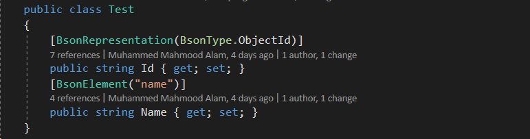
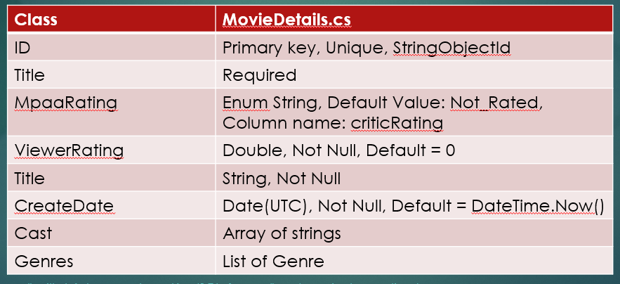

# Mongo Db C#
We would be discussing how to use the Mongo Db c# api to perform various CRUD operations

### [Day 1](#day-1) 
* Creating connection to db using c#
* Understanding the BSON structure and annotations
* Designing Schema and Task
* Definitions and Builders and Combining Filter Conditions
* Finding Documents sync and async
* Inserting Documents sync and async
* Task on schema

## Day 2
* Discuss the Task on schema
* Updating Documents and Upserts
* Deleting Documents
* Sorting  and limiting Documents
* Projections
* Task on CRUD API


## Day 3
* Discuss Task on CRUD API
* Querying with LINQ
* Fluent Aggregation API
* Task on Aggregation

### Day 1
#### Creating connection to db using c#  

A MongoClient object will be the root object. It is thread-safe and is all that is needed to handle connecting to servers.
 - MongoClient()
```js
var client = new MongoClient();
```
 - MongoClient(String) : We  can also pass connection Strings to MongoClient
 ```js
var client = new MongoClient("mongodb://host:27017,host2:27017/");
```
 - MongoClient(MongoClientSettings): Many options can be provided via the connection string or using MongoClientSettings .
 ```js
var client = new MongoClient("mongodb://host:27017,host2:27017/?replicaSet=rs0");
```
```js
var settings = new MongoClientSettings { ReplicaSetName = "rs0" }; 
var client = new MongoClient(settings);
```
```js
var settings1 = MongoClientSettings .FromUrl(MongoUrl.Create("mongodb://localhost:27017"));
var settings2 = new MongoClientSettings { Server = new MongoServerAddress("localhost", 27017), UseSsl = false };
```
 
 Once we have our client we can get the Database and the collection using the client interface.
##### Mongo Database
An IMongoDatabase represents a database in a MongoDB server. Databases are retrieved from an IMongoClient instance using the GetDatabase method.
IMongoDatabase, is responsible for all collection related CRUD operations and some more, such as (Most of those CRUD operations have an async support as well):
 - Create a collection
 - Drop a collection
 - Rename a collection name
 - Get specific collection
 - Lists your collection – provides a metadata information for each of your collections in a specific IMongoDatabase instance, you can use it to log it during debug time or whatever comes to mind.

```js
var db = client.GetDatabase("testdb");
```
In most cases Collection are predefined in context. But in case You need a method to create a Collection through api. We can use CreateCollection or CreateCollectionAsync method of the IMongoDatabase object.
```js
void CreateCollection( string name, CreateCollectionOptions options = null, CancellationToken cancellationToken = null )
```

We can also pass configuration to collection using CreateCollectionOptions.
```js
await db.CreateCollectionAsync("students", new CreateCollectionOptions { AutoIndexId = false, MaxDocuments = 25, Capped = true });
```

* A capped collection is a fixed-sized collection that automatically overwrites its oldest entries when it reaches its maximum size.

##### Mongo Collection
An IMongoCollection<TDocument> represents a collection in a MongoDB database. Collections are retrieved from an IMongoDatabase with the GetCollection<TDocument> method.
The IMongoCollection is your gateway to all of MongoDB’s goodies, using it you will gain access to:
- Indexes API
- Aggregation API
- CRUD API
```js
IMongoCollection<TDocument> dbCollection = db.GetCollection<TDocument>("generic");
IMongoQueryable<TDocument> queryDbCollection = dbCollection.AsQueryable();
```

```js
var collection = db.GetCollection<BsonDocument>("user");
```

#### Designing the schema
Mongo Db internally uses BSON ( Binary Json ) representation. BsonDocument is the default type used for all documents. It handles dynamic documents of any complexity. Although Mongo is schema-less database but it is better to design a Model than using a BsonDocument. It provides type safety.

MongoDB offers two different ways to achieve column and data mapping during its store and retrieve operations:
- Automatic – which is attribute-based or lower case column names. There is also a way of defining system-wide general conventions using ConventionPack
- Manual – We can configure each property using BsonClassMap, RegisterClassMap static method ( Advanced Topic - Not Covered )

#### Schema : Automatic Mapping

Mongo driver provides various annotations that we can use on top of our model to provide metadata on how we want mongo to store the data. This is primarily done by the driver.
- BsonId: lets you specify which property will be act as a unique ID for your document.
- BsonElementAttribute: lets you tweak the name of your property and tells MongoDB under which property key it should be stored inside the JSON.
- BsonRepresentation : Specify the BsonType to be used by MongoDB when persisting.
- BsonDefaultValue: Used to Specify a default value.
- BsonConstructor : Lets you specify the constructor to be used when automapping.
- BsonIgnore : Ignore a specific property to be persisted.
- BsonIgnoreExtraElements : Lets you use a class with missing mappings.
- BsonExtraElements : Lets you handle any extra elements that might be found in a BSON document during deserialization
- BsonDiscriminator : Allows Model classes to be discriminated


You can read about all the avialable anootaions [here](http://mongodb.github.io/mongo-csharp-driver/2.7/reference/bson/mapping/).


#### Schema : BsonId
By convention, a public member called Id, id, or _id will be used as the identifier. You can be specific about this using the BsonIdAttribute. 

- ObjectId is the default Id type.
- Id Generators can be used to specify the type of generator to be used. Some commonly used type are:
    - GuidGenerator : used for a Guid
    - ObjectIdGenerator : used for an ObjectId
    - StringObjectIdGenerator : used for a string represented externally as ObjectId


One case that deserves special mention is representing a string externally as an ObjectId.



The serializer will convert the ObjectId to a string when reading data from the database and will convert the string back to an ObjectId when writing data to the database (the string value must be a valid ObjectId).


More about this topic can be found [here](http://mongodb.github.io/mongo-csharp-driver/2.7/reference/bson/mapping/conventions/) .

### Definitions and Builders and Combining Filter Conditions


#### Task


